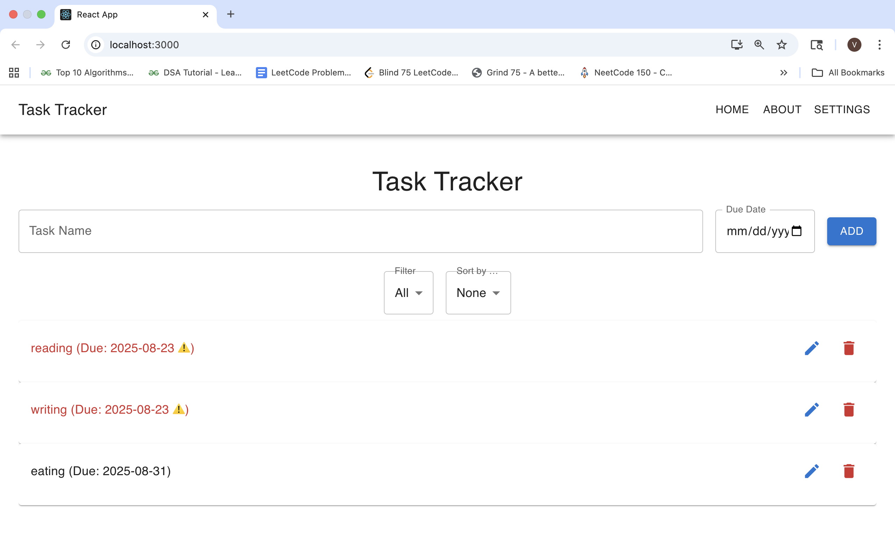
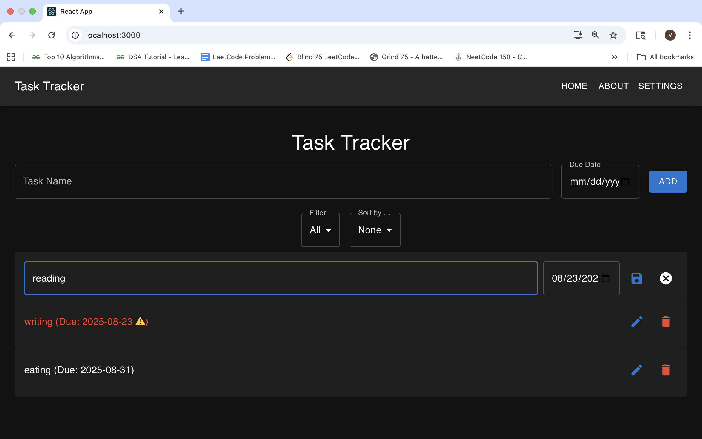
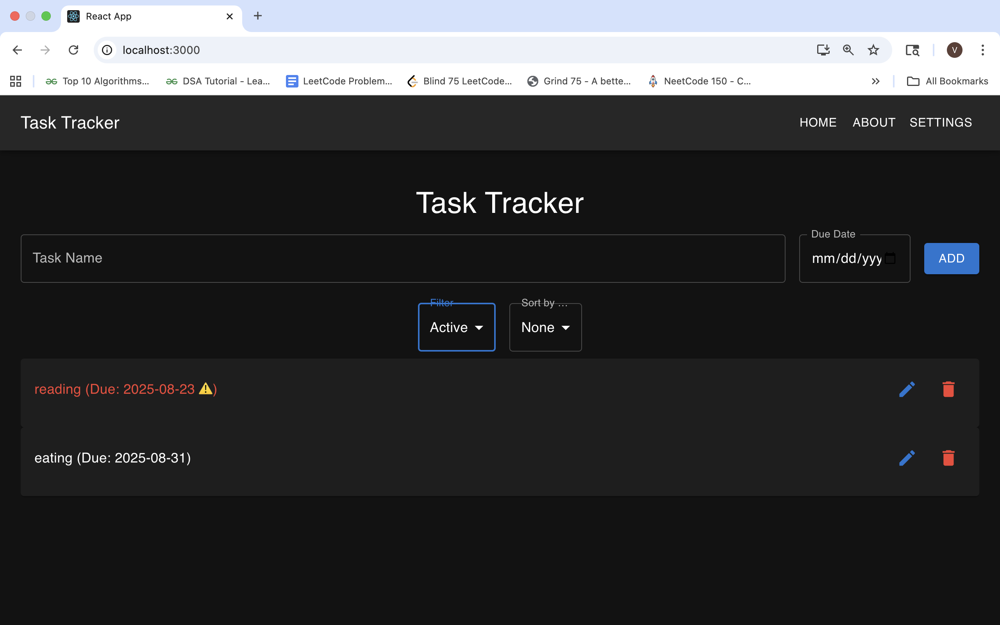
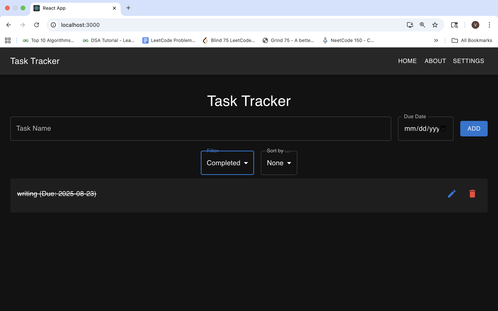
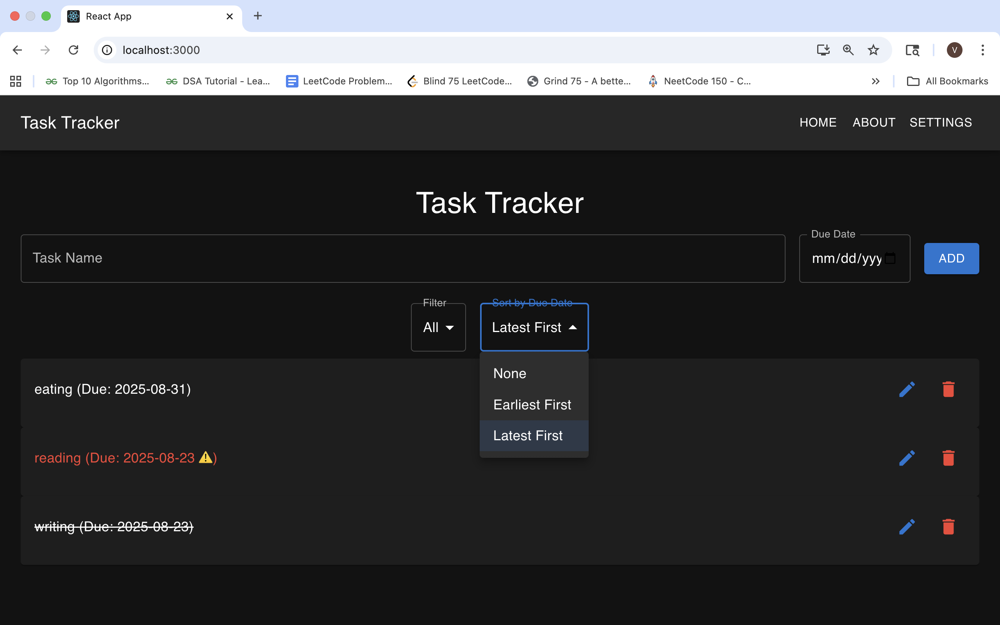
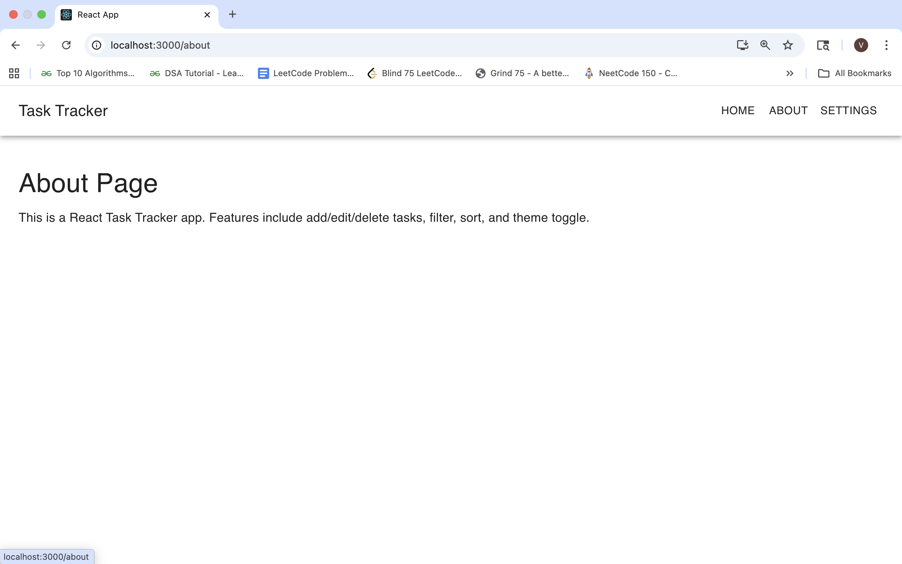
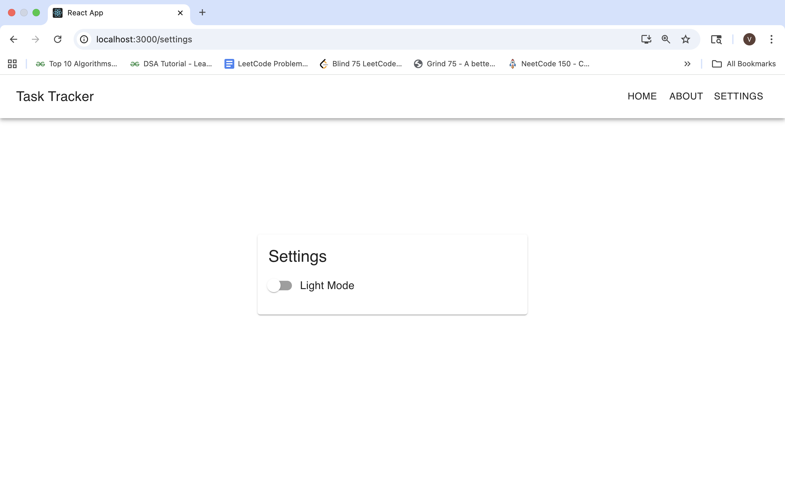
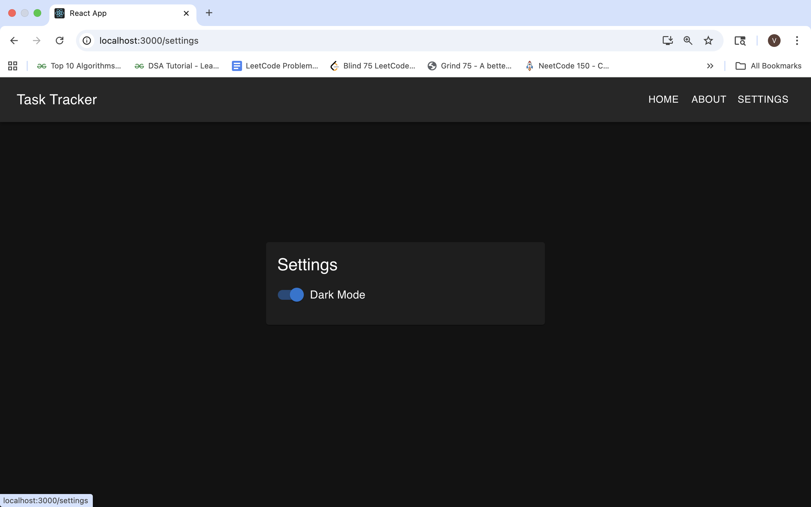

# 📝 React Task Tracker App 

A feature-rich Task Tracker built with React, designed to manage daily tasks efficiently. This app demonstrates modern React practices including state management, hooks, context, animations, and theming, making it a great portfolio project.

---

## 🔥 Features

### Core Task Management
- Add new tasks
- Prevent adding tasks with past due dates
- Edit tasks inline (update task text directly)
- Delete tasks
- Mark tasks as complete/incomplete
- Task list display with dynamic rendering

### Filtering & Sorting
- Filter tasks by All / Completed / Pending
- Sort tasks alphabetically or by creation date

### Theme Toggle
- Switch between Light and Dark mode

### Persistence
- Tasks saved in Local Storage to persist across page reloads

### Navigation & Pages
- Routing with React Router
- About Page – info about the app/project
- Settings Page – manage app preferences (e.g., theme toggle)

### UI & Animations
- Responsive design for desktop & mobile
- Smooth add/delete task animations using Framer Motion
- Styled using Material UI (MUI) components

---

## 🛠 Tech Stack

- Frontend: React.js (Functional Components, Hooks, Context API)
- Styling: CSS + Material UI (MUI)
- State Management: useState, useEffect, Custom Hooks
- Persistence: Browser Local Storage
- Animations: Framer Motion

---

## ⚡ React Concepts Covered

- Components & Props
- State Management (useState)
- Side Effects (useEffect)
- Custom Hooks (e.g., local storage hook)
- Context API for global state
- Conditional Rendering
- Lists & Keys
- Forms & Controlled Components
- UI Libraries (MUI)
- Animations & Responsive Design
- Advanced Features: Filtering, Sorting, Theme Toggle

---

## 🚀 Getting Started

### 1. Clone the repository
```bash
git clone https://github.com/your-username/react-task-tracker.git
cd react-task-tracker
```

### 2. Install dependencies
```bash
npm install
```

### 3. Run the app
```bash
npm start
```
Open http://localhost:3000 in your browser to view the app.

---

## 📁 Project Structure

``` bash
src/
│
├─ components/        # All reusable UI components
│   ├─ Navbar.js
│   ├─ TaskForm.js
│   ├─ TaskItem.js
│   ├─ TaskList.js
│
├─ context/           # Contexts (ThemeContext)
│   ├─ ThemeContext.js
│
├─ hooks/             # Custom hooks
│   ├─ useLocalStorage.js
│   ├─ useTasks.js
│   ├─ useTheme.js
│
├─ pages/             # Full pages (routed)
│   ├─ TaskPage.js
│   ├─ About.js
│   ├─ Settings.js
│   ├─ NotFound.js
│
├─ App.js
├─ index.js
```

---

## Screenshots










---

## 🎯 Future Improvements

- Backend integration for multi-user support
- Notifications & reminders for tasks
- Drag-and-drop task reordering

---

## 👩‍💻 Author
### Pranavi Kolipaka
Feel free to connect: [LinkedIn] (https://www.linkedin.com/in/vns-sai-pranavi-kolipaka-489601208/) | [GitHub] (https://github.com/Pranavi2002)
